# Projet de gestion des patients - Hôpital

Ce projet est une application de gestion des patients pour un hôpital, développée avec Spring Boot, Thymeleaf et Bootstrap pour l'interface utilisateur. L'application permet de gérer les patients avec des fonctionnalités telles que l'affichage, la recherche, la pagination et la suppression.

## Prérequis

- Java 17+
- Spring Boot
- MySQL
- Maven
- Bootstrap

## Installation

1. Clonez le dépôt de l'application.
   
   ```bash
   git clone https://github.com/oussamabartil/Hopital

2. Naviguez dans le répertoire du projet.

   ```bash
   cd hopital
3. Configurez la base de données MySQL avec les informations suivantes dans application.properties :

   ```bash
   spring.datasource.url=jdbc:mysql://localhost:3306/hopital?createDatabaseIfNotExist=true
   spring.datasource.username=root
   spring.datasource.password=your-password
   spring.jpa.hibernate.ddl-auto=update
   spring.jpa.properties.hibernate.dialect=org.hibernate.dialect.MariaDBDialect

4. Installez les dépendances Maven.

    ```bash
    mvn install

5. Démarrez l'application Spring Boot.

    ```bash
    mvn spring-boot:run

## Fonctionnalités
### Affichage des patients
L'application permet de visualiser la liste des patients avec leurs informations : ID, Nom, Date de naissance, Malade, et Score.

### Pagination dynamique
La liste des patients est paginée avec des options de navigation entre les pages.

### Recherche des patients
Il est possible de rechercher des patients par nom avec une pagination dynamique.

### Suppression des patients
L'application permet de supprimer des patients avec confirmation avant la suppression.

## Images
### 1. Installation des dépendances
   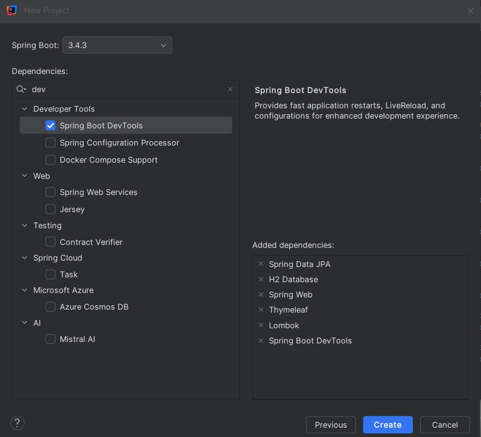
### 2. Ajout de la base de données
   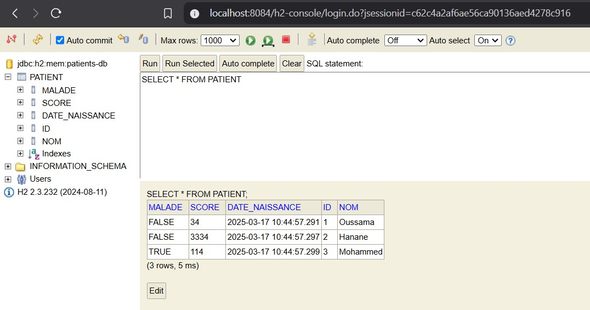
### 3. Liste des patients
   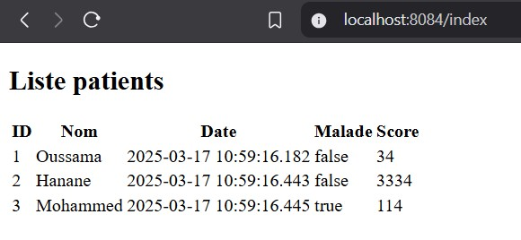
### 4. Ajout de Bootstrap
   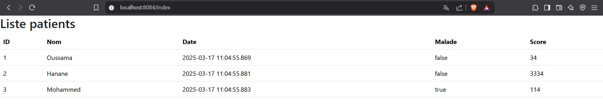
### 5.Design Bootstrap
   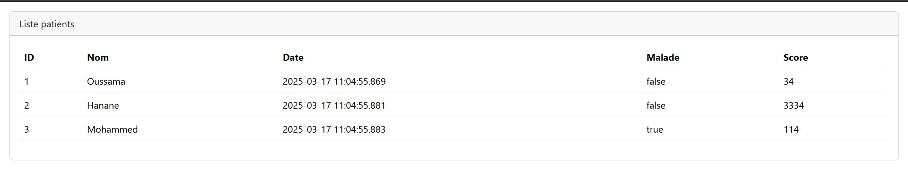
### 6. Avant la pagination
   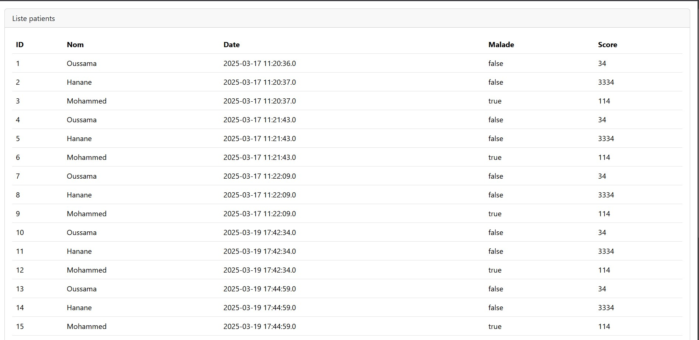
### 7. Après la pagination
   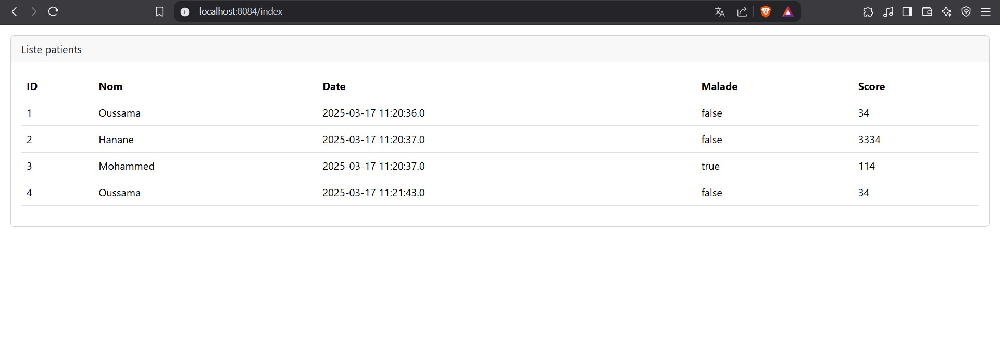
### 8. Pagination avec paramètres
   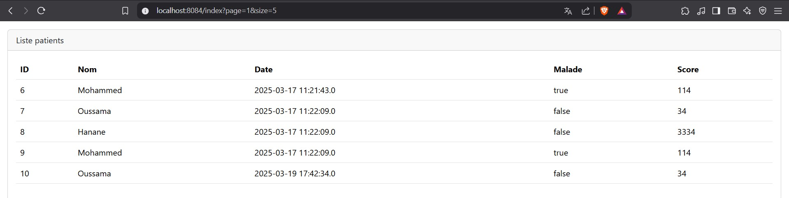
### 9. Application du design de la pagination
   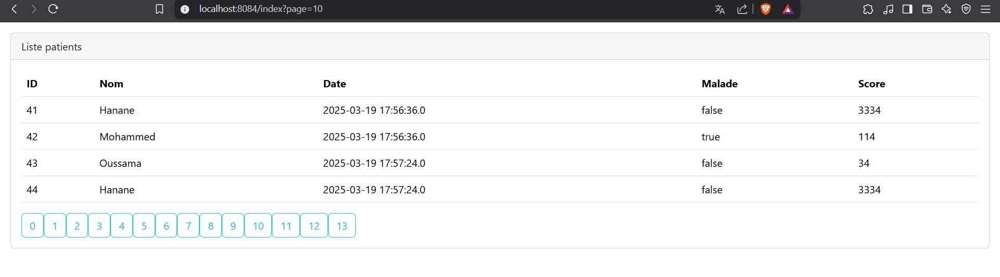
### 10. Surbrillance de la pagination
   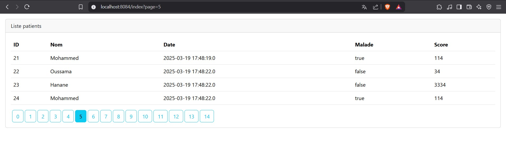
### 11. Recherche des patients
   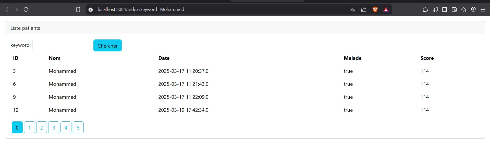
### 12. Ajout de la suppression des patients
   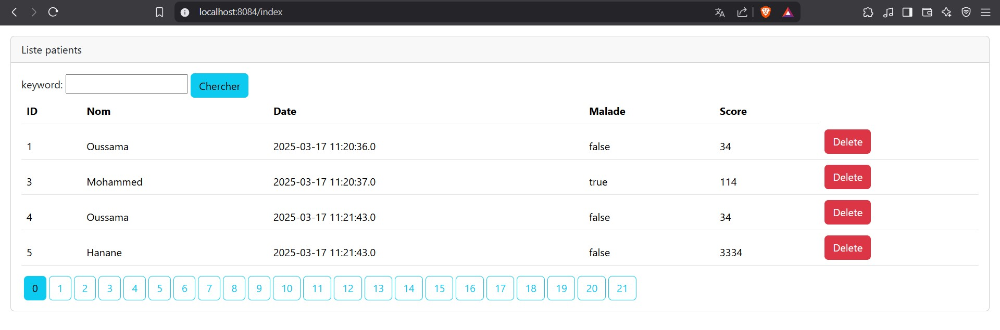
### 13. Message de confirmation de suppression
   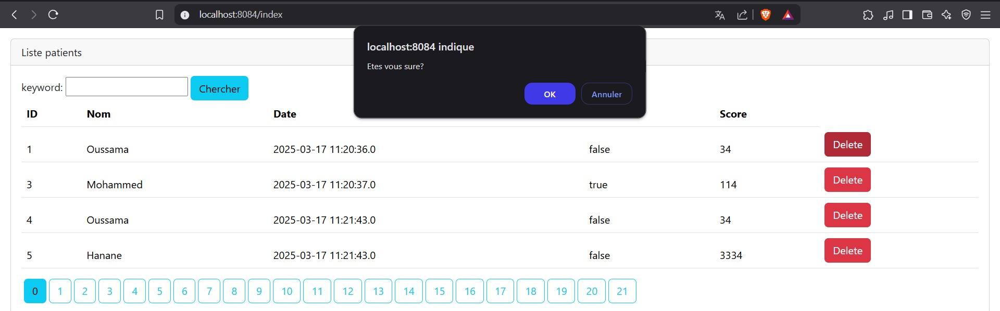
### 14. Utilisation des icônes Bootstrap
   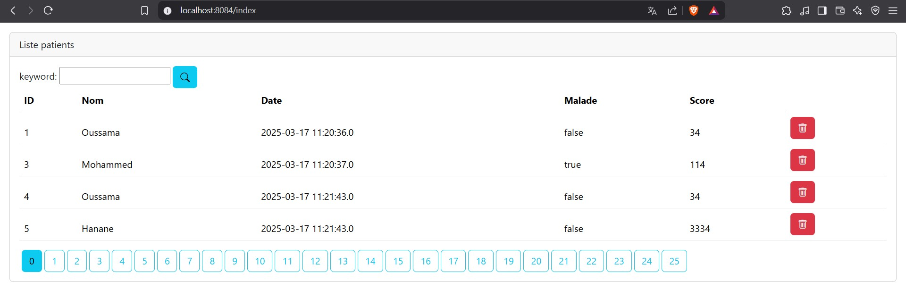
